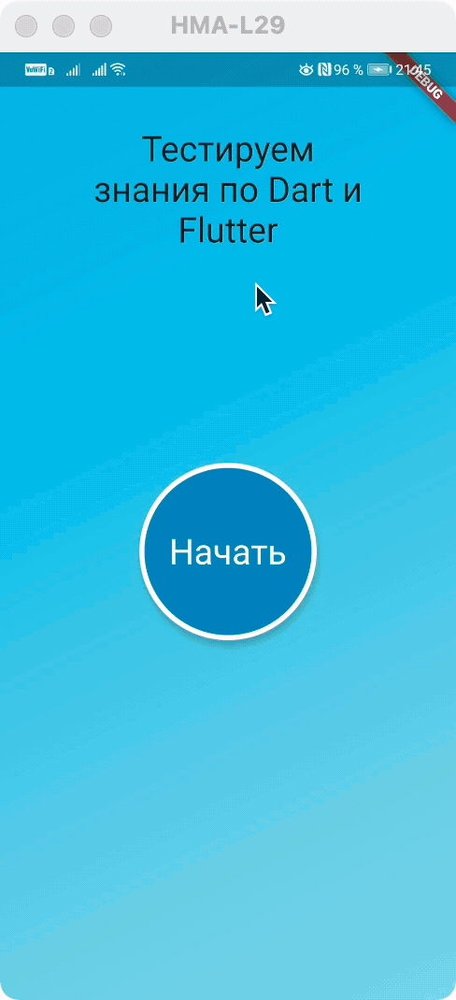

# Задача по MWWM

Реализовать собственный пример на MWWM

## Приложение для тестирования

### Вариант с дизайном

### Базовый вариант

## Использовались библиотеки Surf

- [https://pub.dev/packages/mwwm](https://pub.dev/packages/mwwm)
- [https://pub.dev/packages/relation](https://pub.dev/packages/relation)
